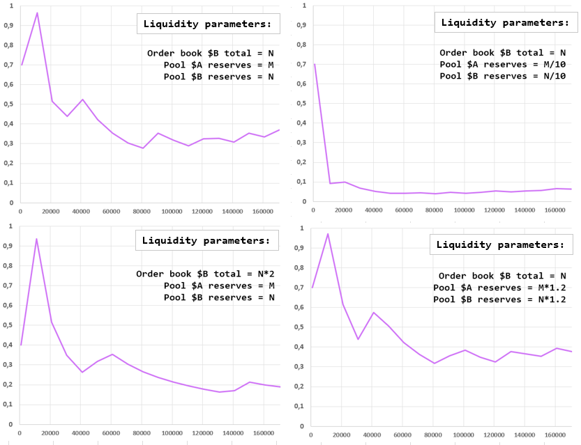

# Research

---
Our goal is providing the best 
price by using combined swap. To prove the
utility of these swaps, we present you our 
simulations of market price formation 
when buying in three different ways:
- from pool only
- from order book only
- combined swap


Here is the chart explaining the price formation.

As you see, when we use combined swap,
at one moment we reach a better price 
compared to order book and pool.
Now let's talk about algorithms behind
these simulations and how they
could work in production.

To make this very beautiful 
chart we had to simulate the one-moment
**abstract market state**. 
On this market we have the total amount  
of $B = N and $A = M and 0.3% transaction fee. 
How did we estimate N and M constants?
Easily, this data was downloaded and parsed from Binance,
so once we reach their turnover,
we know how to deal with it.

Liquidity parameters in simulations:
- from pool only: we have pool reserves $A=M and $B=N
- from order book only: we use Binance's 98K limit sell orders when 
in total people sell N $B starting with token price = M/N
- combined swap: we have pool reserves $A=M/2 and $B=N/2, 
and we use the same order book, but each $B amount is divided by 2


How do our pool works?
Exactly the same as on [Uniswap V2](https://docs.uniswap.org/protocol/V2/concepts/core-concepts/pools)


For all the simulations we used a very simple
python script that iterates trough all possible ratios
and chooses the one who gives us the best $B amount out.

```python
def get_optimal_ratio(
        amount_inA: float,
        orders: list,
        step=100,
        reserves_in=1254000,
        reserves_out=10000) -> list:
    """
    calculation of $A ratio sold in pool to get maximum of $B
    param orders: test order book data
    param step: the precision of algorithm depends on this param
    returns: [
        <ratio of $A sold in pool to get the max of $B>,
        <average $B price>
        ]
    """

    amounts_out = []
    steps = numpy.arange(step, amount_inA, step)

    for amount_in_pool in steps:
        test_orders = orders.copy()
        pool_amount_out = get_amount_out_pool(
            amount_in_pool, reserves_in, reserves_out
        )
        ob_amount_out = get_amount_out_ob(
            amount_inA - amount_in_pool, test_orders
        )
        amounts_out.append(pool_amount_out + ob_amount_out)

    max_amount_out = max(amounts_out)
    max_profit_a_pool = list(steps)[amounts_out.index(max_amount_out)]
    max_profit_a_pool_ratio = max_profit_a_pool/amount_inA
    token_b_price = amount_inA/max_amount_out

    return [max_profit_a_pool_ratio, token_b_price]
```

You can see that this algorithm is not efficient at all 
O(n) complexity and too much memory usage.
However, in production we can avoid using it. How?

Depending on reserves in pool and order book data,
the best ratio curve can take these forms.
- X-axis: total \$A we are swapping.
- Y-axis: percentage of \$B we buy from pool



As you can see, 
starting from 10'000 $A swapping, 
these charts all look like y = k/x^n.
This allows us to say that depending on liquidity 
in pool and order book, 
we will be able to predict the percentage 
of tokens we swap in pool due to mathematical model.
In this case pool ratio calculation will have O(1)complexity.

As you could see previously,
on all the ratio/swap amount curves
we can apply a power trendline y = k/x^n like here:


